# 🧶 Online Knitting Store

Онлайн интернет-магазин вязаных изделий.  
Проект реализует полный цикл работы онлайн-магазина: каталог товаров, корзину, оформление заказов, регистрацию пользователей и административную часть.

## 🚀 Функционал

### 🛍️ Каталог товаров
- Просмотр товаров по категориям
- Страница товара с подробным описанием
- Поддержка скидок
- Поиск и сортировка товаров
- Пагинация

### 🧺 Корзина
- Добавление товаров в корзину без перезагрузки страницы (AJAX)
- Изменение количества товаров
- Удаление товаров
- Корзина для неавторизованных пользователей (по session_key)

### 👤 Пользователи
- Регистрация и авторизация
- Личный кабинет(профиль) пользователя
- Редактирование профиля
- История заказов и статус заказа в личном кабинете

### 📦 Заказы
- Оформление заказа
- Выбор способа доставки
- Выбор способа оплаты (платежные системы не интегрированы)
- Просмотр деталей заказов

### ⚙️ Административная часть
- Управление товарами и категориями
- Управление заказами
- Управление пользователями

## ⚡ Технологии

- Python, Django
- HTML, CSS, JS, Bootstrap
- jQuery, AJAX
- PostgreSQL

## 📸 Скриншоты

### Главная страница
**Приветствие**
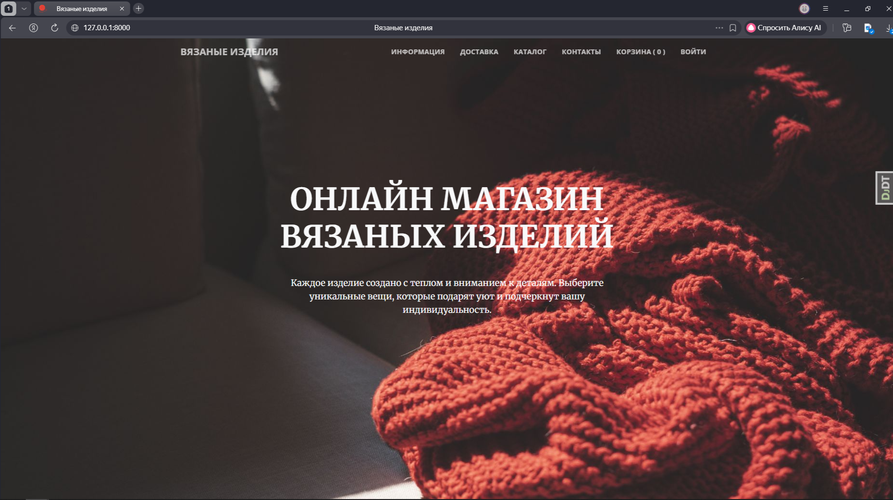

**Информация**
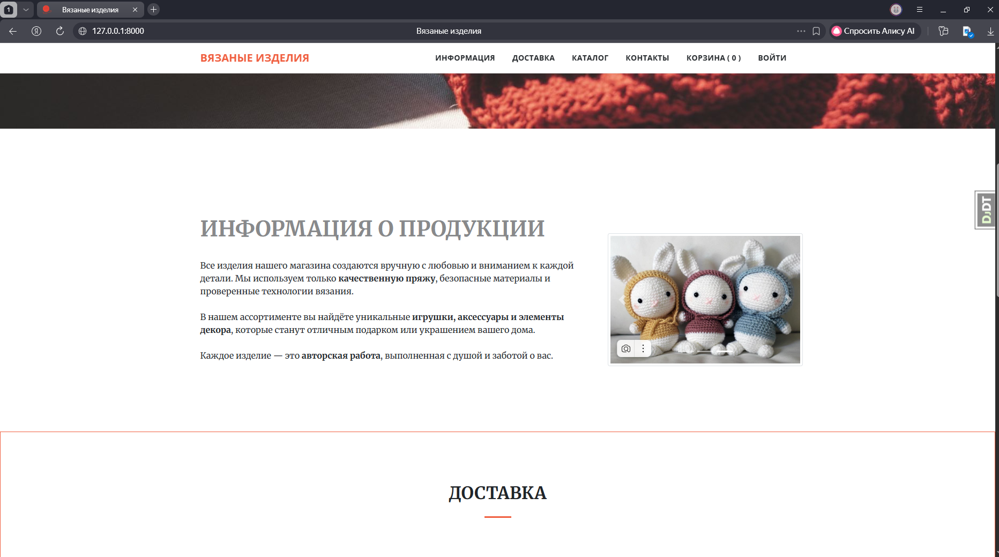

**Доставка**
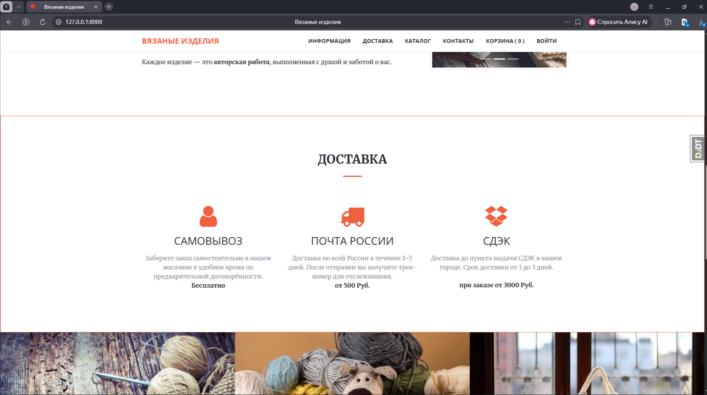

**Категории**
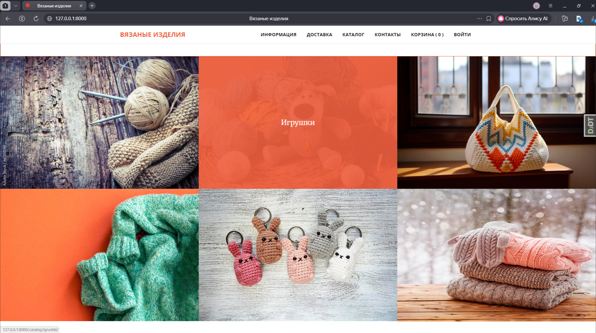

**Контакты**
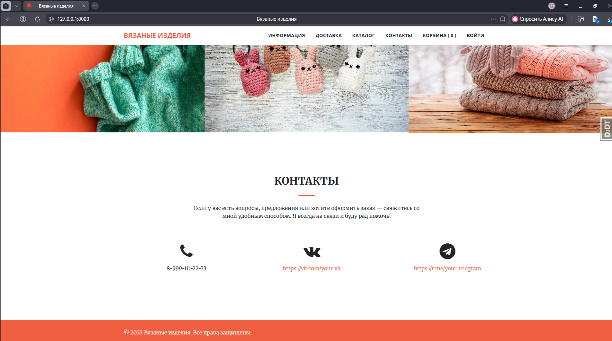

### Каталог
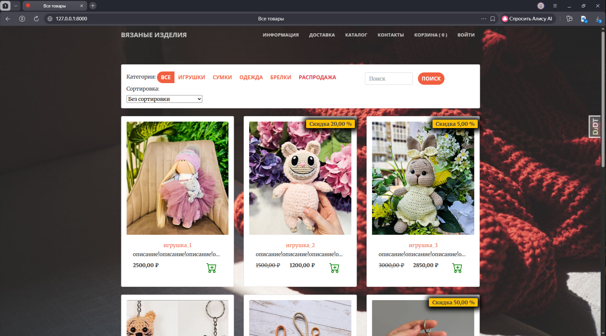

### Карточка товара
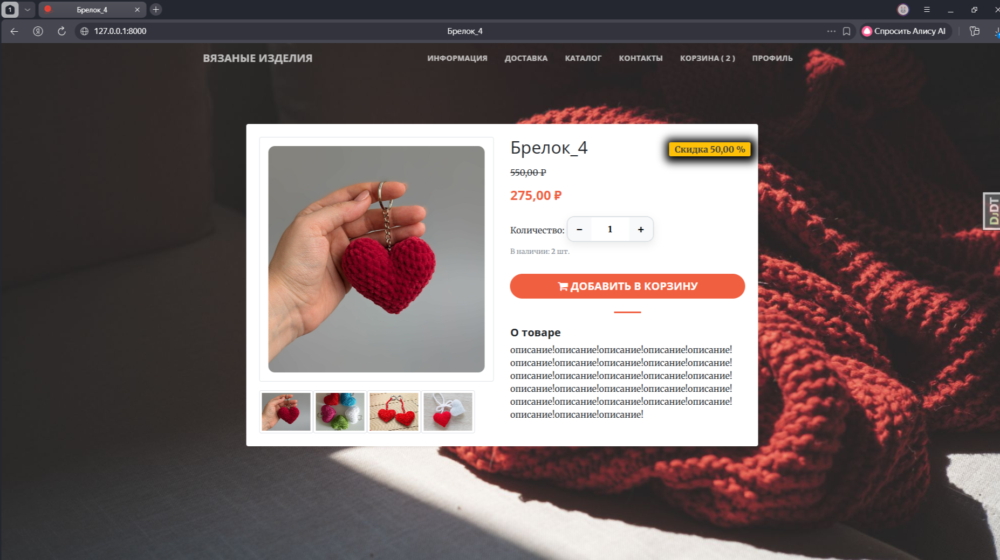

### Авторизация
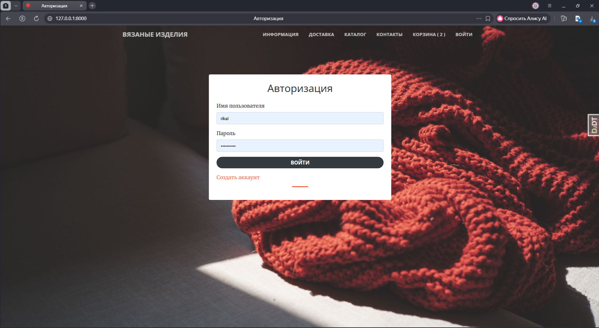

### Регистрация
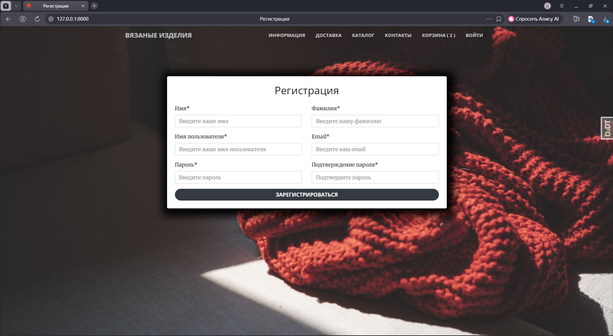

### Профиль
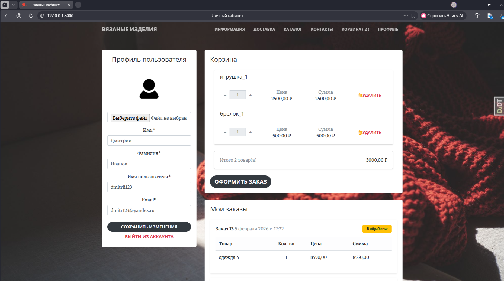

### Корзина
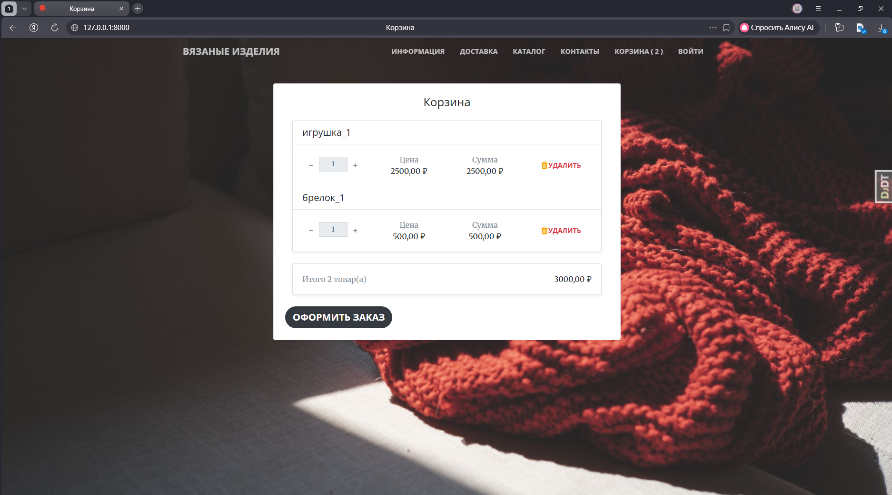
